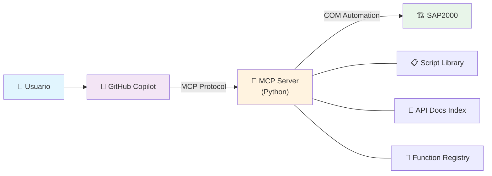

# SAP2000 Automation Framework

[](https://python.org)
[](https://www.csiamerica.com/products/sap2000)
[](LICENSE)
[](https://modelcontextprotocol.io)

**Framework de automatización de SAP2000 mediante Python, COM bridge y Model Context Protocol (MCP).**

Permite generar modelos estructurales, asignar cargas, ejecutar análisis y extraer resultados de forma programática — todo orquestado desde VS Code con GitHub Copilot como interfaz conversacional.

---

## Características Principales

- **MCP Bridge** — Servidor MCP que conecta GitHub Copilot con SAP2000 vía COM automation
- **97 funciones API verificadas** — Registry con firmas, parámetros ByRef y wrappers testeados
- **38+ wrapper scripts** — Funciones individuales documentadas y verificadas contra SAP2000 real
- **Scripts parametrizados** — Modelos completos generados programáticamente (vigas, domos, naves, placas base)
- **5 aplicaciones GUI standalone** — Interfaces PySide6 con worker threads para operación asíncrona
- **Sandbox seguro** — Ejecución aislada de scripts con restricciones de imports y timeout
- **Documentación API completa** — 25 archivos markdown cubriendo toda la API de SAP2000

---

## Arquitectura



### Flujo de Trabajo

1. El usuario describe lo que necesita en lenguaje natural a **Copilot**
2. Copilot consulta el **MCP Server** para buscar documentación y funciones verificadas
3. El MCP Server genera y ejecuta scripts en un **sandbox aislado**
4. SAP2000 procesa los comandos vía **COM automation** y retorna resultados
5. El script se guarda automáticamente en la **biblioteca de scripts**

### Componentes del MCP Server

| Módulo | Función |
|--------|---------|
| `server.py` | Entry point — registro de 12 herramientas MCP |
| `sap_bridge.py` | Conexión COM singleton a SAP2000 |
| `sap_executor.py` | Ejecutor con sandbox (imports restringidos, timeout) |
| `script_library.py` | Persistencia y búsqueda de scripts |
| `doc_search.py` | Motor de búsqueda sobre documentación API |
| `function_registry.py` | Base de datos de funciones verificadas |

---

## Requisitos

| Requisito | Versión |
|-----------|---------|
| **Windows** | 10/11 (SAP2000 solo corre en Windows) |
| **Python** | 3.10+ |
| **SAP2000** | Cualquier versión con soporte API |
| **comtypes** | Última versión |
| **mcp[cli]** | Última versión |
| **PySide6** | Para GUIs standalone (opcional) |

---

## Instalación

```bash
# 1. Clonar repositorio
git clone https://github.com/tu-usuario/Skills_SAP.git
cd Skills_SAP

# 2. Crear y activar entorno virtual
python -m venv .venv
.venv\Scripts\Activate.ps1

# 3. Instalar dependencias
pip install -r mcp_server/requirements.txt

# 4. (Opcional) Para GUIs standalone
pip install PySide6
```

### Configuración en VS Code

El servidor MCP se autoconfigura via `.vscode/mcp.json`. Al abrir el workspace y usar Copilot, el server se inicia automáticamente — no requiere configuración manual.

---

## Scripts de Ejemplo — Galería de Logros

Cada script fue generado conversacionalmente con Copilot, ejecutado y verificado contra SAP2000 real.

### 🔩 Viga Simple — Verificación End-to-End

**Script:** [`example_1001_simple_beam.py`](scripts/example_1001_simple_beam.py)

Verificación completa de una viga simplemente apoyada con carga uniforme. Crea el modelo desde cero, ejecuta el análisis y compara resultados numéricos contra valores calculados a mano.

| Parámetro | Valor |
|-----------|-------|
| Luz | 10 m |
| Carga uniforme | 24 kN/m |
| Material | Acero E=200 GPa |
| Sección | Rectangular 0.5×0.2 m |
| Momento máximo teórico | 300 kN·m |
| Reacción teórica | 120 kN |
| Deflexión teórica | 46.9 mm |

**Logro:** El script verifica automáticamente que los resultados de SAP2000 coinciden con la solución analítica. Funciona como test de regresión de la API completa (materiales → secciones → geometría → cargas → análisis → resultados).

<!-- TODO: Agregar screenshot del modelo en SAP2000 -->

---

### 🔘 Anillo Circular Parametrizado — Generación de Malla

**Script:** [`example_ring_areas_parametric.py`](scripts/example_ring_areas_parametric.py)

Genera un anillo circular (placa anular) con 3 zonas concéntricas de shell, cada una con espesor independiente. La geometría se construye generando puntos en coordenadas polares y conectándolos como quads.

| Parámetro | Valor |
|-----------|-------|
| Radio interior | 1.0 m |
| Radio exterior | 5.0 m |
| Zonas concéntricas | 3 con espesores independientes |
| Segmentos angulares | Configurable (calidad de malla) |
| Elementos generados | Quads de 4 nodos por zona |

**Logro:** Demuestra generación de geometría curva compleja mediante discretización paramétrica. El patrón de zonas concéntricas con propiedades variables es aplicable a fundaciones circulares, tanques y silos.

<!-- TODO: Agregar screenshot del anillo en SAP2000 -->

---

### 🔧 Placa Base con Pernos de Anclaje

**Script:** [`example_placabase_parametric.py`](scripts/example_placabase_parametric.py)

Generador paramétrico de placa base completo: placa, pernos de anclaje, silla opcional (anchor chair), body constraints, TC limits (tension-only en pernos) y resortes de balasto Winkler.

| Parámetro | Valor |
|-----------|-------|
| Pernos | Configurables: 4, 6 u 8 pernos |
| Diámetro de perno | 25 mm (configurable) |
| Silla de anclaje | Opcional, paramétrica |
| Body constraints | Conectan pernos con región circular |
| TC Limits | Pernos solo-tracción (compresión=0) |
| Resorte de balasto | Aplicado en Z=0 sobre áreas |
| Mallado | Refinamiento automático en intersecciones |

**Logro:** Modelo de ingeniería completo listo para análisis. Combina 7+ funciones API diferentes (áreas, frames, constraints, springs, TC limits, mallado). Demuestra workflow real de diseño de conexiones.

<!-- TODO: Agregar screenshot de la placa base en SAP2000 -->

---

### 🏛️ Domo Elipsoidal Parametrizado

**Script:** [`domo_elipsoidal_parametrico_py.py`](scripts/domo_elipsoidal_parametrico_py.py)

Genera un domo elipsoidal 3D con geometría de doble curvatura. Construye la superficie discretizando en anillos meridionales y segmentos circunferenciales, usando quads para el cuerpo y triángulos en el polo superior.

| Parámetro | Valor |
|-----------|-------|
| Semi-eje X | 5.0 m |
| Semi-eje Y | 3.5 m (elíptico) |
| Altura | 2.0 m |
| Anillos meridionales | 8 |
| Segmentos circunferenciales | 20 |
| Espesor shell | 0.15 m |
| Total de elementos | 160 (140 quads + 20 triángulos) |

**Logro:** Geometría de doble curvatura generada completamente por código. El patrón de discretización (quads + triángulos polares) es reutilizable para cualquier superficie de revolución. Material de concreto con propiedades isotrópicas.

<!-- TODO: Agregar screenshot del domo en SAP2000 -->

---

### 🏭 Nave Industrial Mixta — Modelo Complejo

**Script:** [`modelo_complejo_mixto.py`](scripts/modelo_complejo_mixto.py)

Modelo estructural completo de nave industrial que combina múltiples tipos de elementos para ejercitar toda la API verificada. Incluye análisis sísmico con espectro de respuesta NCh2745.

| Componente | Detalle |
|------------|---------|
| Columnas | 6 (5 rectangulares HA + 1 circular) |
| Vigas | 7 (6 rectangulares HA + 1 perfil I acero) |
| Arriostres | 2 diagonales tension-only (Cruz de San Andrés) |
| Losas | 2 losas FEM malladas 3×2 |
| Fundación | Losa corrida con resortes Winkler |
| Apoyos | Articulados (pinned) en bases |
| Diafragma | Rígido en nivel de piso (Z=4m) |
| Patrones de carga | PP, CM, CV, SX, SY, VIENTO |
| Espectro | NCh2745 Zona 3, Suelo II |
| Casos espectrales | RS_SX (U1) y RS_SY (U2) |
| Combinaciones | COMB1, COMB2_SX, COMB3_SY, ENV_ULS |

**Logro:** El script más complejo del repositorio. Demuestra que la API automatizada puede generar un modelo de ingeniería realista con análisis sísmico normativo, múltiples materiales, elementos mixtos y combinaciones de carga LRFD — todo en un solo script ejecutado conversacionalmente.

<!-- TODO: Agregar screenshot de la nave en SAP2000 -->

---

## Aplicaciones GUI Standalone

Interfaces gráficas completas construidas con PySide6, operables sin VS Code ni Copilot. Cada GUI se conecta directamente a SAP2000 via COM.

### Modelo Base Estandarizado

**Archivos:** [`scripts/modelo_base/`](scripts/modelo_base/)

Generador de modelo base con materiales, patrones de carga, secciones de acero/HA, espectros NCh2369 y combinaciones LRFD/ASD/NCh. Configuración completa en archivo `config.py` con parámetros sísmicos por zona.

<!-- TODO: Agregar screenshot de GUI modelo_base -->

### Placa Base Paramétrica

**Archivos:** [`scripts/placabase/`](scripts/placabase/)

Interfaz para generar placas base con control visual de todos los parámetros: pernos, silla de anclaje, balasto, y mallado. Incluye worker threads para ejecución asíncrona sin bloquear la GUI.

<!-- TODO: Agregar screenshot de GUI placabase -->

### Anillo Circular

**Archivos:** [`scripts/ring_areas/`](scripts/ring_areas/)

GUI para generar anillos circulares parametrizados con control de radios, espesores y calidad de malla por zona concéntrica.

<!-- TODO: Agregar screenshot de GUI ring_areas -->

### Explorador de Database Tables

**Archivos:** [`scripts/database_tables/`](scripts/database_tables/)

Navegador y editor de las tablas internas de SAP2000. Permite listar todas las tablas, leer datos, editar celdas y exportar a CSV/XML/Excel. Cubre las 37 funciones de `DatabaseTables.*`.

<!-- TODO: Agregar screenshot de GUI database_tables -->

### Post-Proceso: Estabilidad y Shells

**Archivos:** [`scripts/post_proceso/`](scripts/post_proceso/)

Extracción de resultados de análisis: desplazamientos de nodos (`JointDispl`) para verificación de estabilidad y fuerzas en shells (`AreaForceShell`) para todas las combinaciones de carga. Opera sobre la selección manual del usuario en SAP2000.

<!-- TODO: Agregar screenshot de GUI post_proceso -->

---

## Registry de Funciones Verificadas

El framework mantiene un registro de **97 funciones API** verificadas contra SAP2000 real. Cada entrada incluye:

- **Firma completa** con tipos de parámetros
- **Layout ByRef** — posición de cada parámetro de salida en el tuple retornado
- **Wrapper script** — código ejecutable que demuestra el uso
- **Notas** — particularidades, valores por defecto, errores comunes

Categorías cubiertas:

| Categoría | Funciones | Ejemplo |
|-----------|-----------|---------|
| **File** | 2 | `NewBlank`, `Save`, `OpenFile` |
| **Materials** | 3 | `SetMaterial`, `SetMPIsotropic`, `SetWeightAndMass` |
| **Frame Properties** | 4 | `SetRectangle`, `SetCircle`, `SetISection`, `SetTube` |
| **Area Properties** | 1 | `SetShell_1` |
| **Points** | 3 | `AddCartesian`, `Count`, `GetCoordCartesian` |
| **Frames** | 6 | `AddByPoint`, `AddByCoord`, `SetSection`, `SetTCLimits` |
| **Areas** | 3 | `AddByCoord`, `Count`, `SetSpring` |
| **Load Patterns** | 3 | `Add`, `GetNameList`, `SetSelfWTMultiplier` |
| **Load Cases** | 3+ | `ResponseSpectrum.SetCase/SetLoads/GetLoads` |
| **Combinations** | 4 | `Add`, `SetCaseList`, `GetCaseList`, `GetNameList` |
| **Analysis** | 1 | `RunAnalysis` |
| **Results** | 4 | `JointDispl`, `JointReact`, `FrameForce`, `AreaForceShell` |
| **Database Tables** | 37 | Lectura, escritura, edición, exportación |
| **Selection** | 3 | `ClearSelection`, `CoordinateRange`, `GetSelected` |
| **Constraints** | 2 | `SetBody`, `GetBody` |
| **Design** | 2 | `StartDesign` (acero y concreto) |

---

## Estructura del Proyecto

```
Skills_SAP/
├── mcp_server/           # Servidor MCP (Python)
│   ├── server.py         #   Entry point — 12 herramientas MCP
│   ├── sap_bridge.py     #   Conexión COM singleton
│   ├── sap_executor.py   #   Sandbox de ejecución
│   ├── script_library.py #   Persistencia de scripts
│   ├── doc_search.py     #   Buscador de documentación API
│   ├── function_registry.py  # Registry de funciones verificadas
│   └── tests/            #   Tests unitarios e integración
│
├── scripts/              # Scripts y aplicaciones
│   ├── wrappers/         #   38+ wrappers de funciones individuales
│   ├── templates/        #   Templates base (backend + GUI)
│   ├── modelo_base/      #   GUI: Modelo base estandarizado
│   ├── placabase/        #   GUI: Placa base paramétrica
│   ├── ring_areas/       #   GUI: Anillo circular
│   ├── database_tables/  #   GUI: Explorador de tablas
│   ├── post_proceso/     #   GUI: Estabilidad + shells
│   └── registry.json     #   Registry de 97 funciones verificadas
│
├── API/                  # Documentación API SAP2000 (25 archivos .md)
│
└── .github/
    ├── copilot-instructions.md   # Instrucciones para Copilot
    ├── agents/                    # Agente SAP2000 Scripter
    └── skills/                    # Skill de referencia API
```

---

## Herramientas MCP Disponibles

El servidor expone 12 herramientas que Copilot puede invocar:

| Herramienta | Descripción |
|-------------|-------------|
| `connect_sap2000` | Conectar/adjuntar a instancia de SAP2000 |
| `disconnect_sap2000` | Desconectar del modelo activo |
| `get_model_info` | Obtener info del modelo (unidades, conteos, archivo) |
| `execute_sap_function` | Ejecutar una función API individual |
| `run_sap_script` | Ejecutar un script completo en sandbox |
| `list_scripts` | Listar scripts guardados |
| `load_script` | Cargar código fuente de un script |
| `search_api_docs` | Buscar en documentación API |
| `list_api_categories` | Listar categorías de documentación |
| `query_function_registry` | Consultar funciones verificadas |
| `register_verified_function` | Registrar nueva función verificada |
| `list_registry_categories` | Listar categorías del registry |

---

## Tecnologías

- **Python 3.10+** — Lenguaje principal
- **comtypes** — Interfaz COM para SAP2000
- **MCP (Model Context Protocol)** — Protocolo de comunicación con Copilot
- **FastMCP** — SDK para servidor MCP
- **PySide6** — Framework GUI (aplicaciones standalone)
- **SAP2000 API** — API COM de CSI para análisis estructural

---

## Licencia

Este proyecto está bajo la licencia MIT. Ver [LICENSE](LICENSE) para más detalles.
